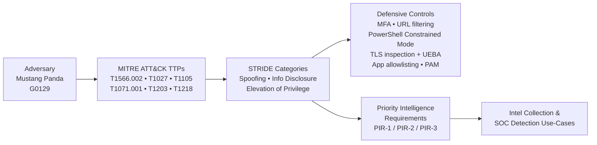

# project-cti-mustang-panda

**A Cyber Threat Intelligence (CTI) program foundation for a cloud-based defense contractor, built around a Mustang Panda (G0129) adversary profile, MITRE ATT&CK mapping, and STRIDE threat model.**

   

---

## Scenario

*Aegis Defense* (simulated small-to-mid cap defense contractor) operates a cloud-enabled environment that houses drone engineering data and collaborates with the U.S. Department of Defense (DoD) through a secure cloud portal, IAM controls, and shared storage repositories. The company is standing up its first formal CTI program and needs three deliverables: **Priority Intelligence Requirements (PIRs)**, an **adversary profile** mapped to MITRE ATT&CK, and a **STRIDE threat model** that translates adversary behavior into specific control recommendations for the cloud portal.

## Deliverables

1. Three PIRs scoped to cloud authentication, cloud misconfiguration, and data-exfiltration indicators — see [`pirs/`](pirs/).
2. A Mustang Panda (G0129) adversary profile with full ATT&CK mapping — see [`adversary/mustang-panda.md`](adversary/mustang-panda.md).
3. A STRIDE threat model covering Spoofing, Information Disclosure, and Elevation of Privilege with paired defensive controls — see [`threat-model/stride.md`](threat-model/stride.md).
4. A machine-readable indicators file for ingestion into a SIEM or TIP — see [`indicators/mustang-panda-iocs.json`](indicators/mustang-panda-iocs.json).

---

## Adversary-to-Control Flow



See [`diagrams/kill-chain.mmd`](diagrams/kill-chain.mmd) for the Mermaid source.

---

## Priority Intelligence Requirements (PIRs)

| PIR | Focus | Decisions Supported |
|---|---|---|
| [PIR-1](pirs/PIR-1.md) | Unauthorized access via credential theft or phishing | MFA enforcement, IAM policy updates, security awareness program adjustments |
| [PIR-2](pirs/PIR-2.md) | Cloud misconfigurations and weak permissions | Config baseline validation, automated compliance checks, alignment with NIST |
| [PIR-3](pirs/PIR-3.md) | Indicators of data exfiltration involving sensitive drone-related data | Incident response triggers, IAM account isolation, DoD reporting thresholds |

---

## Adversary Profile — Mustang Panda (G0129)

| Attribute | Value |
|---|---|
| Origin | China-based; aligned to PRC strategic intelligence priorities |
| Typical targets | Embassies, think tanks, regional research institutions, defense contractors |
| Geographic focus | United States, Europe, Asia (incl. Mongolia-linked decoys) |
| Notable behaviors | Rapid weaponization of new CVEs (e.g., CVE-2017-0199); PowerShell + Cobalt Strike; fileless execution; cloud-hosted delivery (Google Drive links) |

### MITRE ATT&CK techniques profiled

| Tactic | Technique | ID |
|---|---|---|
| Initial Access | Phishing: Spearphishing Link | [T1566.002](https://attack.mitre.org/techniques/T1566/002/) |
| Defense Evasion | Obfuscated Files or Information | [T1027](https://attack.mitre.org/techniques/T1027/) |
| Command and Control | Ingress Tool Transfer | [T1105](https://attack.mitre.org/techniques/T1105/) |
| Command and Control | Application Layer Protocol: Web Protocols | [T1071.001](https://attack.mitre.org/techniques/T1071/001/) |
| Execution | Exploitation for Client Execution | [T1203](https://attack.mitre.org/techniques/T1203/) |
| Privilege Escalation / Defense Evasion | System Binary Proxy Execution | [T1218](https://attack.mitre.org/techniques/T1218/) |
| Execution | Command and Scripting Interpreter: PowerShell | [T1059.001](https://attack.mitre.org/techniques/T1059/001/) |

Full narrative in [`adversary/mustang-panda.md`](adversary/mustang-panda.md).

---

## STRIDE Threat Model (selected dimensions)

| STRIDE Category | Mapped TTP(s) | Primary Controls |
|---|---|---|
| **Spoofing** | T1566.002 | Enforce MFA on all cloud portal and IAM identities; URL filtering to block shortened / lookalike links |
| **Information Disclosure** | T1059.001, T1105, T1071.001 | PowerShell Constrained Language Mode + signed-script enforcement; TLS inspection combined with UEBA to detect anomalous C2 |
| **Elevation of Privilege** | T1218 | Application allowlisting for high-risk binaries (`msiexec.exe`, MMC); Privileged Access Management (PAM) with JIT and session recording |

Full threat model in [`threat-model/stride.md`](threat-model/stride.md).

---

## Skills Demonstrated

- CTI lifecycle — direction, collection requirements, analysis, dissemination
- Priority Intelligence Requirements (PIRs) authoring against a defined stakeholder (leadership / SOC)
- Adversary profiling and attribution using CrowdStrike and MITRE ATT&CK reporting
- MITRE ATT&CK mapping (ID-level precision, not just tactic-level)
- Threat modeling via STRIDE with paired technical controls
- Translating intelligence into actionable SOC / IAM / EDR engineering work
- NIST-aligned control recommendation language

---

## Repository Layout

```
project-cti-mustang-panda/
├── README.md                        ← this file
├── LICENSE                          ← MIT
├── .gitignore
├── references.md                    ← consolidated bibliography
├── pirs/
│   ├── README.md                    ← how these PIRs are structured
│   ├── PIR-1.md                     ← credential theft / phishing
│   ├── PIR-2.md                     ← cloud misconfiguration
│   └── PIR-3.md                     ← data exfiltration indicators
├── adversary/
│   └── mustang-panda.md             ← full adversary profile + ATT&CK mapping
├── threat-model/
│   └── stride.md                    ← STRIDE analysis + control pairings
├── diagrams/
│   └── kill-chain.mmd               ← Mermaid source for the flow diagram
├── indicators/
│   ├── README.md                    ← IOC usage and caveats
│   └── mustang-panda-iocs.json      ← machine-readable IOC list (STIX-like schema)
└── docs/
    └── README.md                    ← sanitized full write-up PDF lives here
```

---

## License

MIT — see [LICENSE](LICENSE).
# project-cti-mustang-panda
